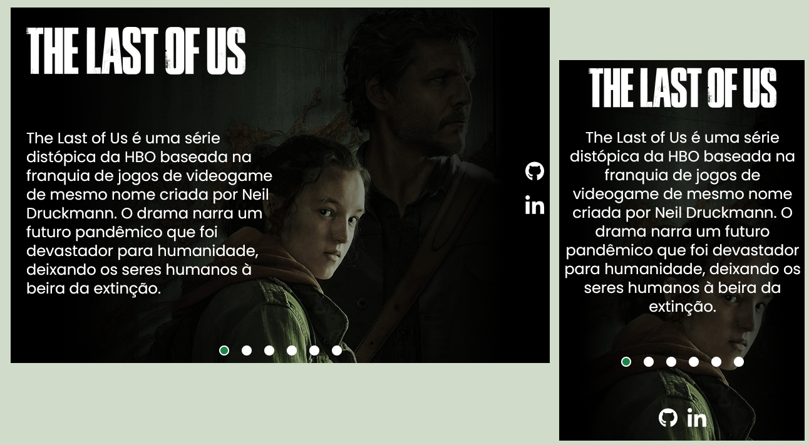

<h1 align="center"> The Last of Us - Série </h1>

  <a href="#-tecnologias">Tecnologias</a>&nbsp;&nbsp;&nbsp;|&nbsp;&nbsp;&nbsp;
  <a href="#-projeto">Projeto</a>&nbsp;&nbsp;&nbsp;

 

  

## 🚀 Tecnologias

Esse projeto foi desenvolvido com as seguintes tecnologias:

- HTML e CSS
- JavaScript
- Git e Github

## 💻 Projeto

Projeto desenvolvido no evento Semana do Zero ao Programador Contratado, disponibilizado pelo Dev em Dobro. Este projeto é uma Landing Page com informações a respeito da série The Last Of Us, baseada no videogame de mesmo nome. Possui versão para Desktop e Mobile. Conta com um carrosel de imagens que podem ser acessadas através do uso dos botões. Você pode visualizar o projeto através [DESTE LINK](https://viviansanchez.github.io/devemdobro-the-last-of-us/)!
